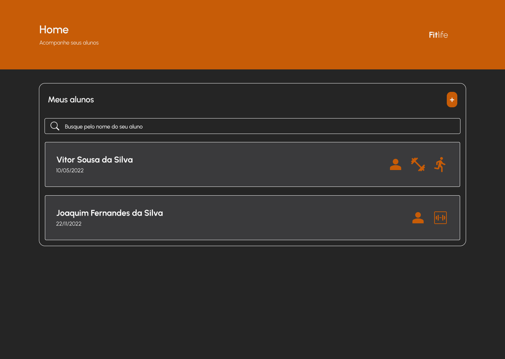

<p align="center">
  
</p>

<p align="center">
  <a href="https://www.typescriptlang.org/">
    
  </a>
  <a href="https://nodejs.org/">
    
  </a>
  <a href="https://reactjs.org/">
    
  </a>
  <a href="https://reactnative.dev/">
    
  </a>
  <a href="https://www.mongodb.com/">
    
  </a>
  <a href="https://expo.dev/">
    
  </a>
</p>

<br />

## Tópicos

<div>
 • <a href="#-sobre-o-FitLife">Sobre o FitLife</a> </br>
 • <a href="#-tecnologias">Tecnologias</a> </br>
 • <a href="#-layout">Layout</a> </br>
 • <a href="#-funcionalidades">Funcionalidades</a> </br>
 • <a href="#-estrutura-de-pastas">Estrutura de pastas</a> </br>
 • <a href="#-estrutura-do-banco-de-dados">Estrutura do banco de dados</a> </br>
 • <a href="#-como-executar-o-projeto">Como executar</a> </br>
 • <a href="#-como-contribuir">Como contribuir</a> </br>
 • <a href="#-autor">Autor</a> </br>
 • <a href="#user-content--licença">Licença</a></br>
</div>

## 💪 Sobre o FitLife

O **FIT**Life é um software para gerenciamento de treinos de musculação para professores e instrutores!

Nele, o professor pode cadastrar seus alunos, montar o treino para o aluno de acordo com as suas necessidades, conferir as cargas e repetições anotadas pelo aluno no app mobile e realizar as modificações.

O projeto foi desenvolvido inteiramente em TypeScript, com o objetivo de reforçar os conceitos aprendidos sobre NodeJs e ReactJS, e além disso, desenvolver habilidades utilizando React Native e ainda melhorar a integração entre o front/back.

## 🚀 Tecnologias

Tecnologias e ferramentas utilizadas no desenvolvimento do projeto:

#### **Website** ( [ReactJS](https://reactjs.org/) + [TypeScript](https://www.typescriptlang.org/) )

-  [React Hook Form](https://react-hook-form.com/)
-  [React Icons](https://react-icons.github.io/react-icons/)
-  [Axios](https://github.com/axios/axios)
-  [StyledComponents](https://styled-components.com/)
-  [Yup](https://github.com/jquense/yup)

#### **Mobile** ( [React Native](https://reactnative.dev/) + [TypeScript](https://www.typescriptlang.org/) )

-  [Expo](https://expo.dev/)
-  [Axios](https://github.com/axios/axios)
-  [StyledComponents](https://styled-components.com/)

#### **API** ( [NodeJS](https://nodejs.org/en/) + [TypeScript](https://www.typescriptlang.org/) )

-  [Mongoose](https://mongoosejs.com/)
-  [Express](https://expressjs.com/pt-br/)

#### **Utilitários**

-  Banco de dados: **[MongoDb](https://www.mongodb.com/)**
-  Protótipo: **[Figma](https://www.figma.com/)** → **[Protótipo (FitLife)](https://www.figma.com/file/UxTRykVdsEdXKMMvMSqraB/Project-FitLife)**
-  Editor: **[Visual Studio Code](https://code.visualstudio.com/)** → Extensions: **[Prettier](https://prettier.io/)** + **[EditorConfig](https://editorconfig.org/)**
-  Fontes: **[OpenSans](https://fonts.google.com/specimen/Open+Sans)**
-  Versionamento: **[Git](https://git-scm.com)**
-  Padronização de código: **[ESLint](https://eslint.org/)**

## 🎨 Layout

O layout da aplicação está disponível no Figma:

<a href="https://www.figma.com/file/UxTRykVdsEdXKMMvMSqraB/Project-FitLife">
  
</a>

<p align="center">
  
</p>

## ⚙️ Funcionalidades

Features que estão sendo adicionadas na aplicação

**Front-end Web**

-  [ ] Adicionar Modal para visualizar os dados de treino
-  [ ] Adicionar busca pelo nome dos alunos no input da home
-  [ ] Consertar visualização do container de criação de treinos
-  [ ] Adicionar input focus e transition
-  [ ] Adicionar button active e transition
-  [ ] Implementar React Router Dom

**Front-end Mobile**

-  [ ] Retirar o imagePath dos exercícios
-  [ ] Modificar o type dos exercises

**Back-end**

-  [x] Estruturar uma forma de linkar o data com o workout
-  [x] Definir um retorno por ordem alfabética dos elementos
-  [x] Passar propriedade populate para todos os useCases que são necessários
-  [ ] Excluir o data relacionado ao treino quando excluir o Workout
-  [ ] Como vou retornar o data com um limite
-  [ ] Editar resposta de erro quando é solicitado os Exercises de um Muscle, mas ele não possui Exercises

## 🛠 Estrutura de pastas e componentes

Afim de facilitar a organização e manutenção do código, foi definido um padrão para organização das pastas neste projeto.

**Front-end Web**

→ \_assets: Contém a estilização global, icones, fontes, tema da aplicação, itens de estilo que são reutilizáveis e imagens; <br />
→ components: Todos os componentes globais do projeto; <br />
→ context: Armazena os contextos da aplicação; <br />
→ services: Todos os acessos externos; <br />
→ utils: Funcionalides que são utilizadas em diversos locais da aplicação; <br />
→ types: Todos as interfaces que são utilizadas em diversos locais da aplicação; <br />
→ hooks: Custom hooks; <br />

Todos os componentes criados vão seguir uma mesma estrutura de organização:
→ index.tsx: Responsável por exportar o componente; <br />
→ interface.ts: Responsável por exportar as interfaces; <br />
→ styles.ts: Responsável por toda estilização do componente; <br />

**Front-end Mobile**

→ \_assets: Contém a estilização global, icones, fontes, tema da aplicação, itens de estilo que são reutilizáveis e imagens; <br />
→ components: Todos os componentes globais do projeto; <br />
→ context: Armazena os contextos da aplicação; <br />
→ services: Todos os acessos externos; <br />
→ utils: Funcionalides que são utilizadas em diversos locais da aplicação; <br />
→ hooks: Custom hooks; <br />
→ routes: Armazena as rotas da aplicação; <br />
→ screens: Armazena as páginas da aplicação; <br />

Todos os componentes criados vão seguir uma mesma estrutura de organização:
→ index.tsx: Responsável por exportar o componente; <br />
→ interface.ts: Responsável por exportar as interfaces; <br />
→ styles.ts: Responsável por toda estilização do componente; <br />

**Back-end**

→ models: Todos os models de Schema para adicionar ao banco de dados; <br />
→ useCases: Armazena todos os casos que são úteis a aplicação. A pasta useCases possui a mesma separação dos models do Schema ; <br />

## 🚀 Como executar o projeto

Este projeto é divido em três partes:

1. Backend (pasta api)
2. Frontend Web (pasta client)
3. Frontend Mobile (pasta app)

💡 O Frontend precisa que o Backend esteja sendo executado para funcionar.

### Pré-requisitos

Antes de começar, você vai precisar ter instalado em sua máquina as seguintes ferramentas: <br />
→ [Git](https://git-scm.com);<br />
→ [Node.js](https://nodejs.org/en/);<br />

Além disto é bom ter um editor para trabalhar com o código como [VSCode](https://code.visualstudio.com/);

Para executar o banco de dados MongoDb, foi utilizado a aplicação do [MongoDB Community](https://www.mongodb.com/try/download/community), mas existem outras alternativas como o [Docker container](https://www.docker.com/resources/what-container/)

#### 🎲 Rodando a aplicação (Backend)

```bash
# Clone este repositório
$ git clone https://github.com/vitorrsousaa/FitLife.git
# Vá para a pasta da aplicação Front End
$ cd api
# Instale as dependências
yarn install
# Rode a aplicação
yarn start
# A aplicação será aberta na porta:3001 - acesse http://localhost:3001
```

---

#### 🧭 Rodando a aplicação web (Frontend)

```bash
# Clone este repositório
$ git clone https://github.com/vitorrsousaa/FitLife.git
# Vá para a pasta da aplicação Front End
$ cd client
# Instale as dependências
yarn install
# Rode a aplicação
yarn start
# A aplicação será aberta na porta:5173 - acesse http://localhost:5173
```

---

#### 🧭 Rodando a aplicação mobile (Frontend)

```bash
# Clone este repositório
$ git clone https://github.com/vitorrsousaa/FitLife.git
# Vá para a pasta da aplicação Front End
$ cd app
# Instale as dependências
yarn install
# Rode a aplicação
yarn start
# A aplicação será visualizado através do [Expo](https://expo.dev/) em um dispositivo físico ou emulador (Android ou iOS)
```

---

# 💭 Como contribuir

Caso queira contribuir, seja corrigindo bugs, adicionando comentários ou novas features, você pode seguir o seguinte tutorial:

-  Faça um **[fork](https://help.github.com/pt/github/getting-started-with-github/fork-a-repo)** desse repositório
-  **[Clone](https://help.github.com/pt/github/creating-cloning-and-archiving-repositories/cloning-a-repository)** o repositório que você fez o fork em seu computador
-  Crie uma branch com a sua feature: `git checkout -b minha-alteracao`
-  Envie suas alterações para a _staging area_: `git add .`
-  Faça um commit contando o que você fez: `git commit -m "feat: minha nova alteracao!"`
-  Faça um push para a sua branch: `git push origin minha-alteracao`
-  Agora é só abrir uma _pull request!_

_Caso tenha alguma dúvida, confira este [guia de como contribuir no GitHub](https://github.com/firstcontributions/first-contributions/blob/master/translations/README.pt_br.md) :)_

<br />

# 📝 License

Esse projeto está sob a licença MIT. Consulte [LICENSE](https://github.com/vitorrsousaa/FitLife/blob/main/LICENSE) para mais informações.

<br />

# 📮 Entre em contato

**Linkedin**: https://www.linkedin.com/in/vitorr-sousaa/

Desenvolvido por **Vitor Sousa** 👋🏻🧑
